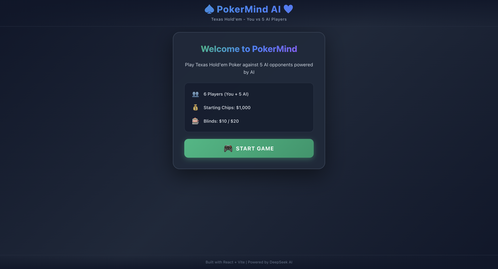
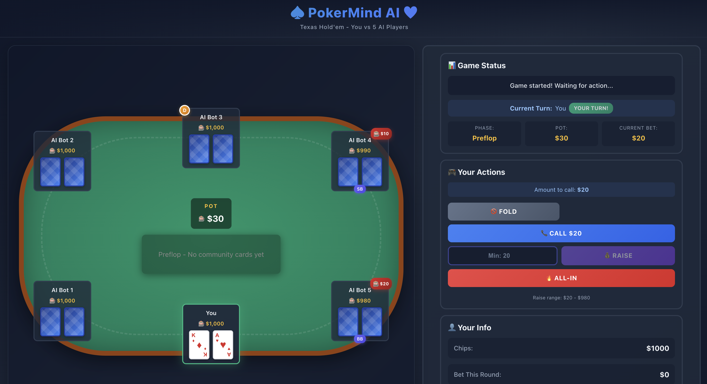

# Frontend 
React+Vite 

## Environment
Node.js v22.20.0

DeepSeek API Key (You can get it from https://platform.deepseek.com/)

## Quick Start
```
npm install
npm run dev 

# open a new terminal
export DEEPSEEK_API_KEY="YOUR_API_KEY"
node server.js  # AI service
```

## Example



